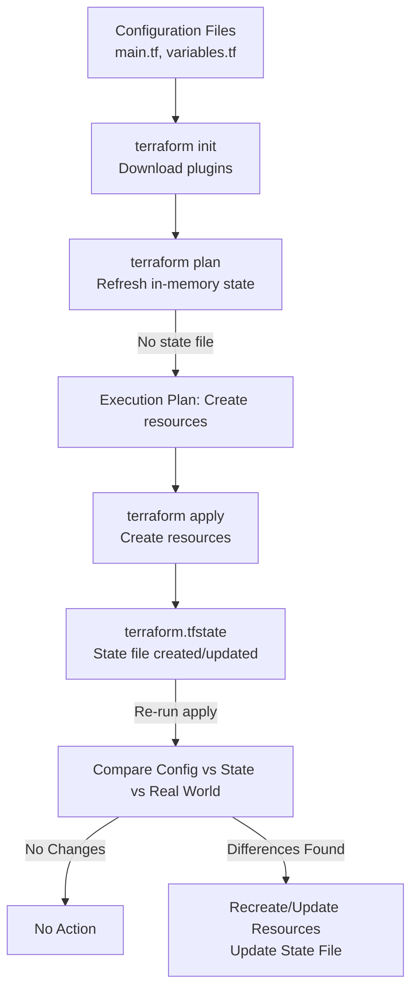

# Terraform Notes: State & Workflow

## Getting Started
- Learned how to:
    - Write simple configuration files (using HCL, not SQL).
    - Declare and use variables.
    - Use reference expressions.
    - Link resources together.

---

## Terraform Workflow Recap
1. **Configuration files**
    - Stored in a directory (e.g., `terraform-local-file`).
    - `main.tf`: resource definitions.
    - `variables.tf`: variable definitions.

2. **Initial state**
    - No resources created yet.

3. **Commands**
    - `terraform init` → downloads necessary plugins.
    - `terraform plan` →
        - Refreshes in-memory state.
        - First run → no state recorded.
        - Generates execution plan to create resources.
    - `terraform apply` →
        - Refreshes in-memory state again.
        - Creates resources once confirmed.
        - Assigns a unique ID to each resource.
        - Example: local file resource created with given content.

---

## Re-running `terraform apply`
- If run again without changes:
    - Terraform detects existing resource (`local_file.pet`).
    - No further action taken.
- **How does Terraform know?**
    - State file (`terraform.tfstate`) is created after the first `apply`.

---

## Terraform State File
- Created only after `terraform apply` is run at least once.
- JSON data structure that:
    - Maps **real-world resources** ↔ **config definitions**.
    - Stores:
        - Resource type.
        - Logical name.
        - Resource ID.
        - Provider info.
        - All resource attributes.
- **Single source of truth** for Terraform.
- Used by `plan` and `apply` to detect changes.

---

## Example: Updating a Resource
- Config file updated → content changed from `"I love pets"` to `"We love pets"`.
- On `terraform plan` / `apply`:
    - Terraform refreshes state.
    - Detects mismatch between config, state, and real-world resource.
    - Decides to **recreate** resource.
- After apply:
    - Old resource deleted (old ID).
    - New resource created (new ID).
    - State file updated with new resource details.

---

## Key Points
- **State file ensures synchronization** between:
    - Config files.
    - Real-world infrastructure.
- When config and state match → no changes.
- State is **not optional**:
    - Always created and maintained.
    - Critical for managing even large, multi-provider infrastructures.

---

## Terraform Workflow Diagram



---

# Terraform Notes: Purpose of State

## Why State is Needed
- State maps **resource configurations** → **real-world infrastructure**.
- Allows Terraform to:
    - Detect drift between config and infrastructure.
    - Generate accurate execution plans.
- State file = **blueprint** of all resources Terraform manages.

---

## Resource Identity
- Each resource gets a **unique ID** recorded in state.
- Applies to:
    - Local resources (e.g., local file).
    - Logical resources (e.g., random pet).
    - Cloud resources (e.g., AWS, GCP, Azure).

---

## Dependencies in State
- State also tracks **metadata**, such as resource dependencies.
- Two types of dependencies:
    - **Implicit**: created by references (e.g., local file depends on random pet).
    - **Explicit**: declared using `depends_on`.

### Example
- Config contains:
    - `random_pet.my_pet`
    - `local_file.cat`
    - `local_file.pet` (depends on random pet).
- Order of creation:
    - Random pet + cat file → created first (in parallel).
    - Pet file → created after random pet.

---

## Deleting Resources
- If resources are removed from config:
    - Terraform consults **state metadata** to determine deletion order.
    - Example: local file (dependent) deleted **before** random pet.

---

## Performance Benefits
- Without state:
    - Terraform must reconcile config with the real-world infra every run.
    - Expensive with **hundreds or thousands** of resources across multiple providers.
- With state:
    - Terraform uses cached attribute values.
    - Avoids re-fetching from providers on every command.
- Can explicitly skip refresh:
```bash
terraform plan -refresh=false
```
- Uses cached values from state file.
- Example: detects content changes → plans replacement without full refresh.

## Collaboration Benefits
- By default, state file (terraform.tfstate) stored locally in the project directory.
- Issues in team environments:
  - Risk of outdated or inconsistent state.
  - Running Terraform simultaneously can cause conflicts.

## Solution: Remote State
- Store state file in a remote data store → shared & synchronized.
- Benefits:
  - Single source of truth across the team. 
  - Secure and consistent state management.
- Examples of remote state backends:
  - AWS S3 
  - HashiCorp Consul 
  - Terraform Cloud

## Summary
- Terraform State is essential for:
  - Mapping config ↔ infrastructure. 
  - Tracking dependencies. 
  - Ensuring proper deletion order. 
  - Improving performance. 
  - Enabling team collaboration.

# Terraform Notes: State Considerations

## Key Reminders About State
- **Terraform State = single source of truth** for what is deployed in the real world.
- State is **non-optional** — always created and used by Terraform.
- Must handle state carefully due to **sensitive information**.

---

## Sensitive Information in State
- State file contains **all details** about infrastructure resources.
- Example: For an EC2 instance, state may include:
    - CPU, memory, OS image, disk type/size.
    - IP address.
    - SSH key pair.
- For databases:
    - May include **initial passwords**.
- Stored in **plain-text JSON** when using local state.
- ➝ Must always store state securely.

---

## Configuration Files vs State Files
- In the project directory:
    - **Configuration files** (`*.tf`): used to provision/manage infrastructure.
    - **State file** (`terraform.tfstate`): tracks real-world resource details.

### Best Practices
- **Config files** → safe to commit to version control (GitHub, GitLab, Bitbucket).
- **State files** → **DO NOT** commit to version control.
    - Instead, use secure **remote backends**:
        - AWS S3
        - Google Cloud Storage
        - Azure Storage
        - Terraform Cloud

---

## Editing State
- State is a **JSON data structure for internal Terraform use**.
- Never edit state files manually.
- If modifications are required:
    - Use **Terraform state commands** (e.g., `terraform state list`, `terraform state rm`, etc.).
    - Will be covered later in detail.

---

## Summary
- State is **mandatory** in Terraform.
- Contains **sensitive information** ➝ requires secure handling.
- Do not store state files in Git repos; instead, use **remote backends**.
- Never manually edit state; use official Terraform commands.
